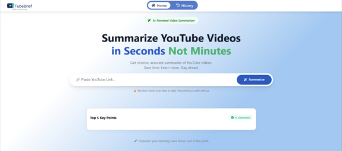
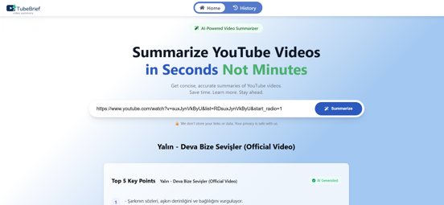
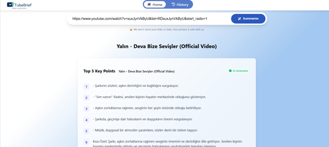
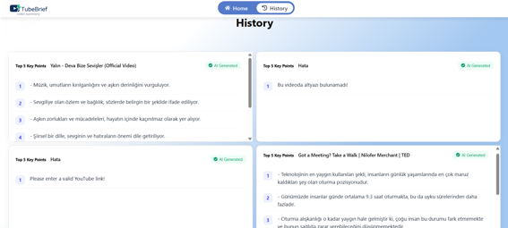

<<<<<<< HEAD

# ⚡ TubeBrief

# TubeBrief, YouTube videolarını hızlıca özetlemenizi sağlayan, yapay zeka destekli modern bir web uygulamasıdır. Uzun videoları izlemek için saatler harcamanıza gerek yok; videonun en önemli noktalarını saniyeler içinde öğrenin.

⚡ TubeBrief
TubeBrief, YouTube videolarını hızlıca özetlemenizi sağlayan, yapay zeka destekli modern bir web uygulamasıdır. Videonun en önemli noktalarını saniyeler içinde 5 madde halinde görüntülemenizi sağlar.

> > > > > > > f020369672c9ec0ccb103796c6eb1c3bd3720cd5

# 🚀 Proje Hakkında

Bu proje, kullanıcıların YouTube video linklerini girerek içeriğin ana hatlarına ulaşmasını sağlayan Full-Stack bir çözümdür. OpenRouter API üzerinden güçlü LLM modelleriyle etkileşime girerek döküm analizleri yapar ve karmaşık içerikleri özetler.

# 🛠️ Teknik Yetenekler

Frontend: React.js, Responsive CSS (Grid & Flexbox mimarisi).
Backend: .NET Web API (OpenRouter API entegrasyonu ile LLM destekli içerik analizi).
Veri Yönetimi: LocalStorage (Geçmiş özetlerin tarayıcı bazlı takibi).
Arayüz Tasarımı: Modüler CSS yaklaşımı ile temiz bir UI/UX.

# ✨ Temel Özellikler

Hızlı Özetleme: Videonun metin dökümünü analiz ederek en önemli 5 noktayı listeler.
Dashboard Görünümü: Geçmiş özetlerinizi 2x2 matris yapısında, düzenli ve kompakt bir panelde görüntüler.
Akıllı Yerleşim: CSS Grid ile her ekran boyutuna uyumlu, kaydırmalı (scrollable) içerik kartları.
Modern Navigasyon: Sabit navbar ve katman yönetimi (z-index) ile kesintisiz kullanıcı deneyimi.

# 📸 Görünüm

 &nbsp;&nbsp;&nbsp;

&nbsp;&nbsp;&nbsp;

# 💻 Kurulum

Projenin hem Frontend (React) hem de Backend (.NET) kısmını çalıştırmak için aşağıdaki adımları takip edin:

# 1. Frontend Kurulumu (React)

Bash

Proje dizinine gidin

cd TubeBriefLLM

npm install

npm start

# 2. Backend Kurulumu (.NET)

Bash (Backend dizinine geçin)

cd BackendAPI/TubeBriefLLM.API

dotnet restore

dotnet run
Not: Backend'in düzgün çalışması için appsettings.json dosyanızda OpenRouter API Key tanımlı olduğundan emin olun.

🏗️ Gelecek Planları
[ ] Kullanıcı hesap yönetimi (Auth) entegrasyonu.
[ ] Özetlerin PDF olarak dışa aktarılması.
[ ] Çoklu dil desteği.

\*\*Bu proje, .NET ve React tabanlı modern bir full-stack mimarisinde, Büyük Dil Modellerinin (LLM Large Language Model) gerçek dünya senaryolarına nasıl entegre edilebileceğini uygulamalı olarak göstermek amacıyla geliştirilmiştir.
